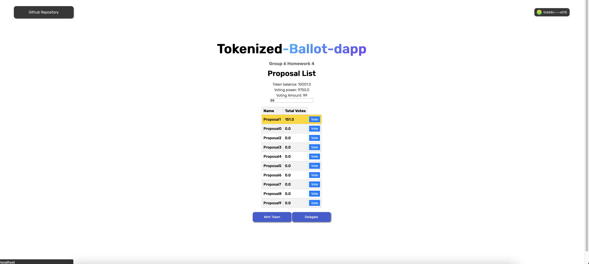
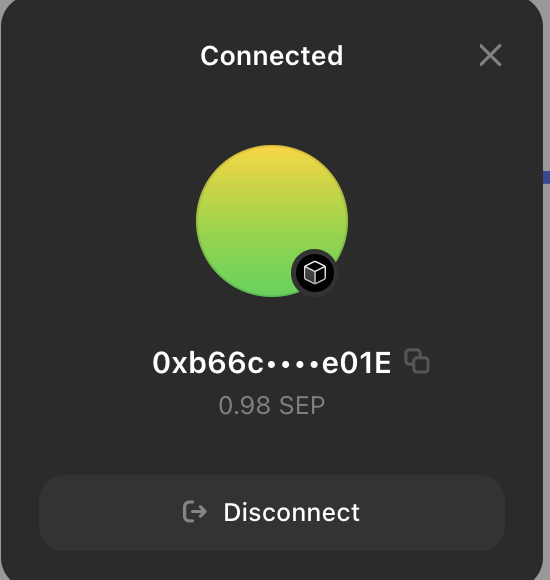
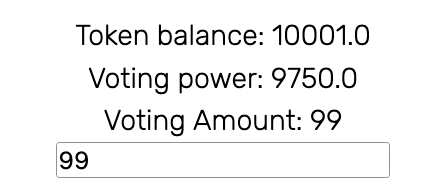

# Tokenized Ballot Dapp



## Getting Started

First, run the development server:

```bash
npm run dev
# or
yarn dev
# or
pnpm dev
```

## Demo

1. Connect to wallet and switch to Sepolia testnet. Ensure you have enough ETH for gas fee.



2. Mint our test ERC20 by clicking the `Mint` button on the bottom.

3. Check you token balance and voting power. You may modify the voting amount.



4. Click vote and confirm the txn.
